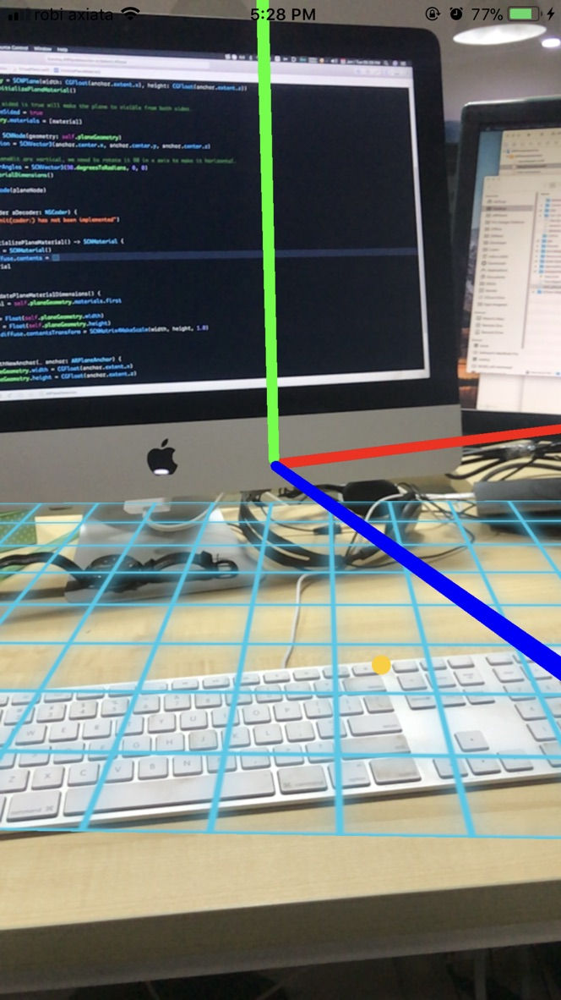

# ARPlaneDetection
Basic ARKit example that demonstrate how to detect horizontal plane.



## Requirements
- Xcode 9 
- Device running iOS 11, with an A9 chip or higher (iPhone 6S or later, iPad Pro)

## Project Summary

Welcome to ARKit! The aim of this basic project setup is to  shows how to start an AR session, detected horizontal plane and add custom node to detected horizontal plane. I am using an `ARSCNView`, a subclass of SCNView view that has an `ARSession`. 

### 1. Configuring and starting the session

The `ARSession` retrives data from the real world and processes it. As we want to place objects on horizontal planes, we need to configure the session to detect them(ARKit can only detect horizontal planes):

```swift
let configuration = ARWorldTrackingSessionConfiguration()
configuration.planeDetection = .horizontal
```

We can then start the session with this configuration by running:

```swift
sceneView.session.run(configuration)
```

### 2. Add a SCNNode to detected planes

Next, we override the `ARSCNViewDelegate` renderer methods. The SceneView will call these methods when AR "anchors" are detected in the real world. Since we've configured the session to detect horizontal planes, these methods will be called for those too.

In didAdd method, we check that the discovered node is a plane, then we created a instance of Virtual Plane which is a type of SCNNode. Finally, we add the plane as a child of the automatically-generated node for the anchor.

```swift
func renderer(_ renderer: SCNSceneRenderer, didAdd node: SCNNode, for anchor: ARAnchor) {
        guard let planeAnchor = anchor as? ARPlaneAnchor else {return}
        let plane = VirtualPlane(anchor: planeAnchor)
        self.planes[planeAnchor.identifier] = plane
        node.addChildNode(plane)
}
```

### 3. Update the SceneKit plane when the AR plane is updated

As the user moves the device camera around the world, the session gets more information about anchors. We implement the didUpdate method, which is called when the session updates an existing anchor, so we can update our SceneKit node to match the AR plane.

```swift
func renderer(_ renderer: SCNSceneRenderer, didUpdate node: SCNNode, for anchor: ARAnchor) {
        guard let planeAnchor = anchor as? ARPlaneAnchor, let plane = planes[planeAnchor.identifier] else {return}
        plane.updateWithNewAnchor(planeAnchor)
}
```

### 4. Remove the SceneKit plane when the AR plane is removed

Finally, we implemented didRemove delegate method to remove any SceneKit planes dictionary if a plane is removed from the world.

```swift
func renderer(_ renderer: SCNSceneRenderer, didRemove node: SCNNode, for anchor: ARAnchor) {
  guard let planeAnchor = anchor as? ARPlaneAnchor, let index = planes.index(forKey: planeAnchor.identifier) 
      else {
            return
        }
      // If a node has been deleted then we do not need to keep it in the dictionary
      planes.remove(at: index)
}
```

### 5. VirtualPlane

VirtualPlane is custom class which is subclass of SCNNode. We used a custom class instead of SCNNode is to keep the code reuseable and clean.

To initialize `VirtualPlane` we have to pass `ARPlaneAnchor` as parameter so that planeNode can set its position according to the anchor.
